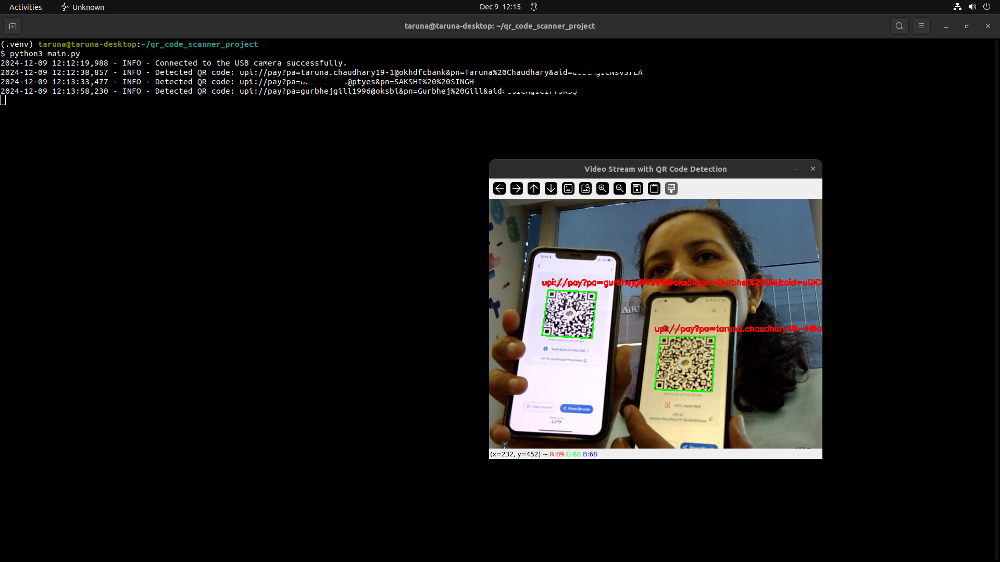

# QR Code Scanner Project

This project is designed to use a USB camera to capture video frames, detect QR codes in real-time, and log detected QR code values. The project displays the video stream with QR code bounding boxes and overlays, while also saving the detected QR codes to a CSV file.

## Project Structure

```
.
├── camera/
│   ├── camera_handler.py       # Handles camera operations like connecting and capturing frames
├── config/
│   └── settings.json           # Configuration file (e.g., camera index)
├── data/
│   └── qr_codes.csv            # CSV file storing detected QR codes
├── logs/
│   └── app.log                 # Log file for application events
├── qr_code/
│   ├── qr_code_reader.py       # Detects QR codes in video frames
├── main.py                     # Main script to run the application
├── requirements.txt            # Python dependencies
```

## Prerequisites

- Python 3.7 or higher
- USB camera connected to the system

## Installation

1. Clone the repository:
   ```bash
   git clone <repository_url>
   cd QR-code-scanner
   ```

2. Create a virtual environment and activate it:
   ```bash
   python3 -m venv .venv
   source .venv/bin/activate
   ```

3. Install the required dependencies:
   ```bash
   pip3 install -r requirements.txt
   ```

## Running the Application

Run the `main.py` script to start the application:
```bash
python3 main.py
```


- The application will:
  - Display a real-time video stream.
  - Highlight detected QR codes with bounding boxes.
  - Log detected QR codes in the `logs/app.log` file.
  - Save detected QR codes in the `data/qr_codes.csv` file.

- Press the `q` key to exit the video stream and close the application.

## Output

- **Video Stream**: A window titled "Real-Time QR Code Detection" will display the video feed with detected QR codes highlighted.
- **Logs**: Detection events and errors are logged in `logs/app.log`.
- **Data**: Detected QR codes with timestamps are saved in `data/qr_codes.csv`.
